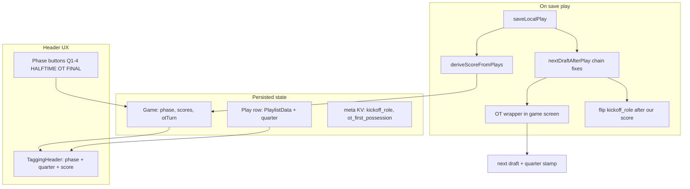

# Game phase, score, kickoff/OT UX (session 2)

Canonical handoff doc for session 2: quarter-on-play schema, game phase/score/OT meta, chain fixes, PBP scenarios, and iPad phase/OT/halftime UX.

**Related docs and code:**

- [Overtime rules](overtime-rules.md)
- [Play-by-play test corpus](play-by-play-test-corpus.md)
- [PBP exception UX](pbp-exception-ux.md)
- Shared schema & export: [`packages/shared/src/index.ts`](../packages/shared/src/index.ts)
- SQLite schema: [`apps/mobile/lib/db/schema.ts`](../apps/mobile/lib/db/schema.ts)

---

## Locked decisions

These are fixed for this session — do not revisit without explicit product sign-off.

1. **Quarter on every play** — `QTR` column immediately after `PLAY #` in export (32-column playlist; document non-standard vs raw Hudl).
2. **Halftime = app state only, not a play row** — `phase = HALFTIME` is app-only; no halftime play row. When saving during Q2→HALFTIME transition, stamp next play's `quarter` as 3 when user starts 2H.
3. **HS OT first possession = UI choice (like We kick / We receive)** — Start OT modal: "We have ball first" / "They have ball first" → `otPossession` + `defaultHsOtPossessionSnap`.
4. **Score auto from plays, no tagger confirm** — recompute on each save; header updates silently; no ScoringPad confirm step.
5. **Safety = +2 to the team on DEFENSE on that play** — odk O → them, odk D → us.
6. **OT win = when `phase === OT` and score creates decisive lead after equal OT possessions → `phase: FINAL`** — score logic only, not a new chain primitive.
7. **Do NOT wire `{ overtime: true }` into `liveDraftFromLastPlay` from mobile** — OT via game meta wrapper later (`nextDraftForGame` reads `phase === "OT"`).

---

## Todos

| ID | Status | Task |
|----|--------|------|
| `chain-punt-flip` | pending | `playChain`: 4th-down punt → odk D + Punt Rec; unit tests |
| `chain-return-td` | pending | `playChain`: KO/punt return TD (`completion end:TD`) → `defaultScoringPlayAfterTd` |
| `pbp-scenarios` | pending | Add punt-odk-flip, kickoff-return-td-scoring, defensive-special-td-catalog, onside-recovery scenarios; fix cfbd-normal-drives play 6 |
| `schema-quarter-phase` | pending | Add quarter to PlaylistData/export/SQLite/sync; `games.phase` + `otPossession`; migration v2 |
| `score-auto` | pending | `deriveScoreFromPlays` + OT win detection; wire `updateLocalScore` on save |
| `ux-14-kickoff-flip` | pending | Flip `kickoff_role` to kick after our FG/XP/2pt Good |
| `ux-phase-ot` | pending | GamePhaseBar, TaggingHeader quarter/phase, Start OT modal, OT `nextDraftForGame` wrapper |
| `ux-halftime-catchup` | pending | Halftime catch-up mode variant in PlayLogSidebar |

---

## Current state

| Area | Today | Gap |
|------|-------|-----|
| **PlaylistData** | 31 Hudl columns, no quarter | Locked: add `quarter` per play + export column |
| **Game row** | `homeScore`/`awayScore`/`status` in SQLite; never auto-updated | Locked: derive score from plays, no tagger confirm |
| **Phase / OT** | Fixture-only (`PbpGameMeta.overtime`); HS OT chain exists behind `PlayChainOptions` | Locked: app meta + UI; **do not** pass `{ overtime: true }` into `liveDraftFromLastPlay` yet |
| **Punt after 4th** | Spot updates; ODK stays `O` | Locked: flip to `D` + `Punt Rec` |
| **KO return TD** | UI encodes `end:TD`; chain → offense Run pad | Locked: route to ScoringPad (spec §6 gap) |
| **Kickoff role UX-14** | Opening choice persists after our FG | P0 defect in [package-i-qa-report.md](package-i-qa-report.md) |

**Key files:**

- [`packages/shared/src/index.ts`](../packages/shared/src/index.ts) — `playlistDataSchema`, export headers
- [`packages/shared/src/playChain.ts`](../packages/shared/src/playChain.ts) — chain logic
- [`apps/mobile/app/game/[id].tsx`](../apps/mobile/app/game/[id].tsx) — save path, score wiring
- [`apps/mobile/lib/tagging/kickoffRole.ts`](../apps/mobile/lib/tagging/kickoffRole.ts) — kickoff role meta
- [`apps/mobile/lib/db/schema.ts`](../apps/mobile/lib/db/schema.ts) — SQLite v2 migration
- [overtime-rules.md](overtime-rules.md) — HS OT possession rules

---

## Architecture



### OT split (respects locked decision)

- **Replay/fixtures:** keep existing `PlayChainOptions` path in [`packages/shared/src/pbp/replay.ts`](../packages/shared/src/pbp/replay.ts) for corpus tests.
- **Live iPad:** new `nextDraftForGame(savedPlay, gameMeta)` in mobile (or thin shared helper) reads `phase === "OT"` and applies HS OT rules **without** changing `liveDraftFromLastPlay` signature:
  - After XP/2pt Good → `defaultHsOtPossessionSnap` with flipped ODK
  - After failed 4th / turnover on downs in OT → flip possession @ ±10 (reuse `turnoverSituation` spot + `defaultHsOtPossessionSnap`)
  - After TD in OT → still `defaultScoringPlayAfterTd` (unchanged chain)
  - **OT win:** when score puts one team ahead after both sides have had equal OT possessions (e.g. 2nd-team FG after 1st-team scoreless) → set `phase: FINAL`, `status: final` — **score logic only**, not a new chain primitive

---

## Workstream 1 — Schema and score

### 1a. `quarter` on every play

- Add `quarter: z.number().int().min(1).max(5)` to `playlistDataSchema` in [`packages/shared/src/index.ts`](../packages/shared/src/index.ts).
  - **Convention:** 1–4 = regulation; **5 = OT** (phase still stored separately on game).
- Extend `PLAYLIST_DATA_HEADERS` with **`QTR`** immediately after `PLAY #` (32-column export; document non-standard vs raw Hudl in [`hudl-csv.md`](../packages/shared/fixtures/pbp/mapping/hudl-csv.md)).
- Update `toPlaylistDataRow`, [`hudlCsv.ts`](../packages/shared/src/pbp/hudlCsv.ts), ingest script, CFBD mapper (`period` → `quarter`, cap at 5).
- SQLite **schema v2** ([`schema.ts`](../apps/mobile/lib/db/schema.ts)): `plays.quarter INTEGER NOT NULL DEFAULT 1`; migration for existing rows.
- Sync payload in [`engine.ts`](../apps/mobile/lib/sync/engine.ts): include `quarter` on play create (Convex mutation may need matching field—check and extend if plays table exists server-side).

### 1b. Game phase meta

Add to `games` table (preferred over scattered meta keys):

```ts
type GamePhase = "Q1" | "Q2" | "Q3" | "Q4" | "HALFTIME" | "OT" | "FINAL";
```

- `phase: GamePhase` (default `Q1`)
- `otPossession: "us" | "them"` — who is on offense for the current OT series (mirrors kickoff-role pattern)

Optional meta key `ot_first_possession` for audit; primary driver is `otPossession`.

**Halftime:** `phase = HALFTIME` is app-only — **no play row**. When saving during Q2→HALFTIME transition, stamp next play's `quarter` as 3 when user starts 2H.

### 1c. Auto score from plays

New shared module e.g. [`packages/shared/src/scoreFromPlays.ts`](../packages/shared/src/scoreFromPlays.ts):

| Play signal | Points (tagged-team perspective) |
|-------------|-------------------------------------|
| `Rush, TD` / `Complete, TD` / return TD via `completion` `end:TD` | +6 **us** when our offense/special teams score |
| `Extra Pt.` / `2 Pt.` + `Good` | +1 / +2 **us** when `odk === O` on the attempt |
| `FG` + `Good` | +3 **us** when `odk === O` |
| `Safety` (`result: Safety` or live-ball `end:SA`) | **+2 to the team on defense on that play** — i.e. **them** when `odk === O`, **us** when `odk === D` |

- Offensive scoring: our points when `odk === O` on the scoring play (K-return TD: receiving team is offense → `odk` on KO Rec row).
- Defensive/special-teams TDs: credit **us** when `odk === D` on the TD play (then XP block path).
- On each save in [`game/[id].tsx`](../apps/mobile/app/game/[id].tsx): recompute → `updateLocalScore` ([`games.ts`](../apps/mobile/lib/db/games.ts)).
- OT win check: if `phase === OT` and new score creates decisive lead after equal possessions, auto-set `phase: FINAL`.
- **No ScoringPad confirm step** — header updates silently.

---

## Workstream 2 — Chain fixes (shared + replay)

Changes in [`playChain.ts`](../packages/shared/src/playChain.ts):

### 2a. Punt → defense / Punt Rec

After a **successful punt** (4th-down `Punt` with `Downed` / `Return` / `Touchback`, not `Blocked`):

```ts
// New branch before generic return at end of nextDraftAfterPlay
if (isPuntPlay(play.playType) && play.down === 4 && !isLiveBallTurnover(play)) {
  return {
    ...defaultOffensivePlay(nextPlayNumber, team),
    ...advanceSituation(play),
    odk: ODK.Defense,
    playType: PlayType.PuntReceive,
    ...emptyPlayers,
  };
}
```

Add `defaultPuntReceivePlay` in [`defaults.ts`](../packages/shared/src/defaults.ts) if cleaner than inline.

**Implementer note:** chain updates spot correctly today but leaves `ODK=O`; product must flip to defense for opponent series.

### 2b. Return TD → ScoringPad

Add helper `isReturnTouchdown(play)` — true when kickoff/punt `completion` decodes to `end:TD` (reuse existing decoders in playChain).

Before scrimmage-TD branch:

```ts
if (isReturnTouchdown(play)) {
  // Return team scores: KO Rec / punt return → odk O for XP; if we were K on KO, receiving team is offense
  const scoringOdk = /* derive from playType + odk */;
  return defaultScoringPlayAfterTd(nextPlayNumber, team, scoringOdk);
}
```

Unit tests in [`playChain.test.ts`](../packages/shared/src/playChain.test.ts); update [`padClass.ts`](../packages/shared/src/pbp/padClass.ts) if draft class must match saved `scoring`.

### 2c. UX-14 kickoff role flip (mobile)

In save handler after our scoring play (`FG`/`XP`/`2pt` + `Good`, our `odk === O`):

- `setKickoffRole(gameId, "kick")` and update local state so next kickoff defaults **We kick**.

Do **not** flip on opponent scores (they kick next — user still picks receive/kick but default should be **We receive**).

---

## Workstream 3 — PBP scenarios

Add under [`packages/shared/fixtures/pbp/scenarios/`](../packages/shared/fixtures/pbp/scenarios/):

| Scenario | Asserts |
|----------|---------|
| `punt-odk-flip.json` | 4th punt downed → next `odk: D`, `playType: Punt Rec`, correct spot |
| `kickoff-return-td-scoring.json` | KO Rec `end:TD` → next pad `scoring`, XP preloaded |
| `defensive-special-td-catalog.json` | Rows: defense rush TD, INT return TD, fumble return TD, blocked punt TD (chain → scoring pad) |
| `onside-recovery.json` | Short kick + recovery spot; documents Package H live-ball path |

**Fixture maintenance:**

- Update [cfbd-normal-drives](../packages/shared/fixtures/pbp/games/cfbd-normal-drives/plays.jsonl) play 6 → `odk: "D"` after punt fix (replay will fail until updated).
- Add `quarter` to scenario plays once schema lands (default `1` for existing fixtures).
- Document new scenarios in [play-by-play-test-corpus.md](play-by-play-test-corpus.md).

---

## Workstream 4 — iPad UX

### 4a. Phase bar + header

New component e.g. `GamePhaseBar.tsx` (below [TaggingHeader](../apps/mobile/components/tagging/TaggingHeader.tsx) or integrated):

- Tappable segments: **Q1 Q2 Q3 Q4 | HALFTIME | OT | FINAL**
- Active segment = `game.phase`
- On transition:
  - **Q2 → HALFTIME:** set phase only; optional prompt for halftime catch-up
  - **HALFTIME → Q3:** set phase `Q3`, offer 2H kickoff catch-up (see 4c)
  - **→ OT:** open Start OT modal (4b)
  - **→ FINAL:** confirm; lock tagging or allow review-only

[TaggingHeader](../apps/mobile/components/tagging/TaggingHeader.tsx): show **`Q{draft.quarter}`** + phase badge + live score.

### 4b. Start OT + first possession

Modal (same tap pattern as [KickoffTaggingPad](../apps/mobile/components/tagging/KickoffTaggingPad.tsx) We kick/receive):

- **We have ball first** → `otPossession: us`, draft `defaultHsOtPossessionSnap(..., ODK.Offense)`
- **They have ball first** → `otPossession: them`, draft `defaultHsOtPossessionSnap(..., ODK.Defense)`

Set `phase: OT`, stamp `quarter: 5` on OT plays. No OT period counter.

Wire save path through `nextDraftForGame` (workstream 1 OT wrapper), not raw `liveDraftFromLastPlay(..., { overtime: true })`.

### 4c. Halftime catch-up mode

Extend existing catch-up in [PlayLogSidebar](../apps/mobile/components/tagging/PlayLogSidebar.tsx):

- When `phase === HALFTIME` or user taps **Start 2nd half**, enter catch-up with banner: *"Halftime catch-up — tag 2H kickoff sequence"*
- Pre-hint: kickoff @ Own 40, `odk: K`, suggest kickoff role flip from end-of-1H score context
- Reuse generic catch-up insert flow; no halftime play row

### 4d. Onside kick (minimal v1)

Per [pbp-exception-ux.md](pbp-exception-ux.md): banner on Kickoff pad when user selects short kick / onside flow — *"Onside kick — confirm receiving spot."* Full Package H recovery UX can follow in a later pass.

---

## Suggested implementation order

1. **Chain fixes + unit tests** (2a, 2b) — unblocks scenarios and OT-independent QA
2. **PBP scenarios** (workstream 3) — lock chain behavior in CI
3. **Schema + quarter stamp on save** (1a, 1b)
4. **Score derivation + UX-14** (1c, 2c)
5. **Phase bar, OT modal, halftime catch-up** (workstream 4)
6. **OT wrapper + win detection** (1 OT section) — depends on phase meta

---

## Out of scope (this session)

- Passing `{ overtime: true }` into `liveDraftFromLastPlay` from mobile (explicitly deferred)
- NCAA/NFL OT UX (corpus only; HS is product default)
- Full stats revisit UX at breaks ([ipad-tagging-spec.md](ipad-tagging-spec.md) § deferred)
- Convex schema changes beyond minimal play `quarter` field if server lacks it (flag during step 1a)

---

## Verification

- `npm run test --workspace=@huddlestat/shared` — playChain + new score tests
- `npm run test:pbp` — all games + new scenarios pass after cfbd-normal-drives update
- Manual iPad: Q1→Q4 flow, halftime catch-up, Start OT first-possession choice, punt flip to Punt Rec, KO return TD → ScoringPad, our FG → We kick (UX-14), score header updates without confirm
