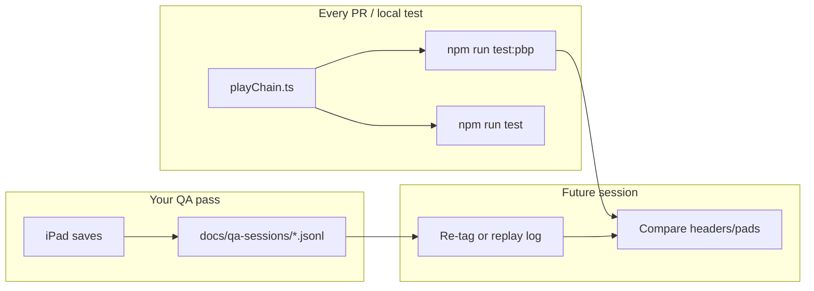

# iPad QA — full application pass

**Purpose:** Run a structured manual QA session across the entire HuddleStat iPad tagging app — UI, UX, play cursor, game phases (halftime, final, OT), catch-up flows, and play-chain correctness — while **logging every save** so future code changes can be checked against what you tagged on device.

**Use with:** a Cursor session and the copy-paste prompt in [IMPLEMENTATION-PROMPT-IPAD-QA-PASS.md](./IMPLEMENTATION-PROMPT-IPAD-QA-PASS.md).

**Existing docs this extends (do not duplicate blindly — follow links):**

| Doc | Role |
|-----|------|
| [package-i-qa-walkthrough.md](./package-i-qa-walkthrough.md) | Beginner Metro + Script A step-by-step |
| [ipad-qa-checklist.md](./ipad-qa-checklist.md) | Batched checklist rows A–K |
| [ipad-qa-play-scripts.md](./ipad-qa-play-scripts.md) | Scripts A–I tag steps |
| [package-i-qa-report.md](./package-i-qa-report.md) | Prior session results |
| [play-by-play-test-corpus.md](./play-by-play-test-corpus.md) | Automated chain regression |
| [game-phase-otux.md](./game-phase-otux.md) | Phase / OT / halftime design |
| [overtime-rules.md](./overtime-rules.md) | HS OT possession rules |
| [field-position-model.md](./field-position-model.md) | Yard line math |
| [ipad-tagging-spec.md](./ipad-tagging-spec.md) | Source spec |

---

## What this pass is for

The app is **not Friday-night complete**, but it is close enough that you need two things:

1. **Human proof** — pads, header, sidebar, phase bar, and catch-up feel right on a real iPad in landscape.
2. **A durable log** — every play you save during QA becomes a baseline. When we change `playChain.ts`, kickoff role, phase transitions, or pad routing, we can ask: *did this session still pass?*

This doc covers **how to run the pass**, **what to log**, and **how logs connect to automated regression**.

---

## Part 0 — Expo on your Mac + iPad (saved setup)

### Which server is which?

| Port | Source | Use for QA? |
|------|--------|-------------|
| **8081** | Old Expo from sibling **`HuddleStat`** repo (different folder) | **No** — quit that terminal |
| **8082** | **`huddlestat-tagging`** — correct app | **Yes** |
| **8083** | Broken web preview | **No** — ignore |

You only need **8082** from this repo.

### One-time install

```bash
cd ~/huddlestat-tagging
nvm use          # Node 22 — see docs/node-version.md
npm install
```

Optional cloud sync (not required for QA):

```bash
cp apps/mobile/.env.example apps/mobile/.env
# Edit only if testing sync — physical iPad needs LAN IP, not 127.0.0.1
```

### Start Metro (every session)

**Terminal 1 — leave open while testing:**

```bash
cd ~/huddlestat-tagging
nvm use
npm run dev:mobile:qa
```

This starts the **QA log sidecar** (port 8099) and **Expo** (port 8082). The iPad auto-streams every save to your Mac — no export button.

Alternative (Expo only, no live Mac log):

```bash
cd apps/mobile
REACT_NATIVE_PACKAGER_HOSTNAME=$(ipconfig getifaddr en0) npx expo start --clear --lan --port 8082
```

Wait for:

```text
Waiting on http://localhost:8082
```

Notes:

- **`--lan`** — iPad reaches your Mac over Wi‑Fi (required on physical device).
- **`REACT_NATIVE_PACKAGER_HOSTNAME=…`** — binds Metro to your Mac’s LAN IP so Expo Go does not try localhost.
- **`--clear`** — clears Metro cache after shared-package or dependency changes.
- **Do not use `--tunnel`** — ngrok body errors were hit in prior QA; LAN is preferred.

Alternative from repo root:

```bash
npm run dev:mobile:clear
```

If that defaults to port 8081, prefer the explicit **8082** command above.

### Connect iPad

| Step | Action |
|------|--------|
| Wi‑Fi | iPad and Mac on **same network** (not guest Wi‑Fi) |
| Expo Go | App Store → **Expo Go** (SDK 54) |
| Orientation | **Landscape** |
| Local Network | iOS Settings → Expo Go → **Local Network ON** |
| Open app | Scan QR in Terminal **or** manual URL below |

**Manual URL** (if QR fails):

```text
exp://YOUR_MAC_IP:8082
```

Find `YOUR_MAC_IP`:

```bash
ipconfig getifaddr en0
```

Example from prior session: `exp://192.168.7.24:8082`.

### Confirm correct app

Home screen must show:

- Title: **HuddleStat**
- Subtitle: **iPad Tagger · offline-first**
- Button: **+ New game**

If you see a different UI, you connected to **8081** (wrong repo). Quit Expo Go and reconnect to **8082**.

### Troubleshooting

| Problem | Fix |
|---------|-----|
| Red error screen | Shake iPad → Reload; confirm Metro still running |
| `Unable to resolve ./constants.js` | Stop Expo; `npx expo start --clear --lan --port 8082` |
| `configs.toReversed is not a function` | `nvm use` (Node 22), restart Expo |
| Cannot connect | Same Wi‑Fi; manual `exp://IP:8082`; check Local Network permission |
| Wrong app | Port 8081 — use 8082 from `huddlestat-tagging` |
| SAVE disabled | Select play type + result (defaults usually OK) |
| Convex warning on home | Expected offline — QA does not require `.env` |

---

## Part 1 — Session setup

Before tagging, record in your log file (see Part 2):

| Field | Example |
|-------|---------|
| Date | 2026-06-01 |
| Branch / commit | `main @ abc1234` |
| Tester | Your name |
| Device | iPad Pro 12.9", Expo Go |
| Metro command | `--lan --port 8082` |
| Game id | UUID from URL or home screen slug |
| Team / opponent | `SHS` vs `QA Test` |

**Pre-flight commands** (Mac, optional but recommended):

```bash
cd ~/huddlestat-tagging && nvm use
git rev-parse --short HEAD
npm run typecheck
npm run test
npm run test:pbp
```

Record pass/fail of automated tests in session header — chain bugs may already show in CI before you pick up the iPad.

---

## Part 2 — Automatic QA logging (Mac live stream)

**You do not type log lines or press export.** Use **`npm run dev:mobile:qa`** — the iPad auto-POSTs every save to a Mac sidecar.

### Mac sidecar (recommended)

| Process | Port | What you see |
|---------|------|--------------|
| **QA log sidecar** | **8099** | `✓ SAVE #2 · …` · `◆ PHASE` · chain drift warnings |
| **Expo Metro** | **8082** | Bundler/HMR only — **not** structured play data |

The Metro terminal looks busy but is mostly bundle noise. **Play QA lines appear in the sidecar output** (same terminal window when using `dev:mobile:qa`).

Example sidecar output:

```text
✓ SAVE #2 · Run · Rush (+50) → PLAY #3 · Q1 · Q1 · 1st & 10 @ 25 · Run
◆ PHASE Q2→HALFTIME
→ catch-up-start · live #8
✗ SAVE #6 · Field Goal · Good → …   ← red = chain drift vs playChain.ts today
```

Files append automatically to:

```text
docs/qa-sessions/live/session.jsonl
```

Cursor and other agents can read that path from the repo root — no absolute Mac path needed.

### What gets logged (iPad → Mac + SQLite backup)

| Event | When |
|-------|------|
| Session | First save in a game |
| Save | Every **SAVE PLAY** — full `savedPlay` + `nextDraft` |
| Phase | Q1→Q2, HALFTIME, OT, FINAL |
| Cursor | Catch-up, edit, resume live |

Implementation: `apps/mobile/lib/qa/logger.ts` · `scripts/qa-log-server.mjs` · SQLite `qa_log` (backup if sidecar is down).

### Replay after code changes

```bash
npm run qa:replay -- docs/qa-sessions/live/session.jsonl
```

Exit code **1** = chain regression against your session.

### Fallback: export button

If you started Expo without the sidecar (`dev:mobile:clear` only), use **QA log (N)** on device to AirDrop the SQLite export.

---

## Part 3 — What to test (detailed)

Run scripts **A → I** from [ipad-qa-play-scripts.md](./ipad-qa-play-scripts.md). Mark MUST vs Should per [ipad-qa-checklist.md](./ipad-qa-checklist.md).

### 3A — UI (visual / layout)

| ID | Check | Where |
|----|-------|-------|
| UI-01 | **72/28 split** — pad left, sidebar right | All screens |
| UI-02 | **SAVE PLAY** only bottom-right of sidebar | Never on pad |
| UI-03 | TaggingHeader: PLAY #, Q badge, phase badge, situation, score | Navy bar |
| UI-04 | GamePhaseBar segments Q1–Q4, HALF, OT, FINAL | Below header |
| UI-05 | Kickoff / Run / Pass / FG / Scoring pads render without scroll-as-primary | Left pad |
| UI-06 | Field sliders: friendly labels (`Own 25`, `Opp 28`) | Kickoff, tackle spots |
| UI-07 | Gain/loss read-only under tackle/return sliders | Run, Pass, Sack |
| UI-08 | Jersey grid visible; hero tier sized consistently | Run, Pass, Sack |
| UI-09 | Start OT modal — two large choices | Tap OT in phase bar |
| UI-10 | FINAL locks phase bar (segments dimmed) | After End game |

### 3B — UX (feel / tap budget / backlog)

Track failures against UX IDs in [ipad-qa-checklist.md](./ipad-qa-checklist.md) § UX backlog.

Priority items for this pass:

| ID | What to notice |
|----|----------------|
| UX-01–02 | Opponent territory shows `+25` vs bare `25` — header vs slider consistency |
| UX-05 | Run rusher auto-default |
| UX-09 | Sack rusher = passer leader |
| UX-11 | 4th in FG range → FG pad default (Script A Play 6) |
| UX-14 | **Our score → We kick** on next kickoff (Script A Play 7, Script B) |
| UX-16–17 | Sidebar density — 2 vs 3 prior plays |

For each UX fail: log `result: fail`, UX id in `notes`, screenshot optional (not committed).

### 3C — Play cursor (live vs off-live)

**Play cursor** = where the app thinks you are in the game: draft `playNumber`, situation line, pad, and whether you are on the **live edge** or **off-live**.

| State | How you enter | Sidebar signal | Log `mode` |
|-------|---------------|----------------|------------|
| **Live** | Default after save | No yellow resume button | `live` |
| **Catch-up** | Tap **Catch-up missed play** | Banner + **Resume live · play #N** | `catch-up` |
| **Edit prior** | Tap a play in last-2 list | **Resume live · play #N** | `edit` |
| **Quarter review** | Phase transition (Q1→Q2, etc.) | Quarter-break banner | `catch-up` + `catchUpHint` |
| **Halftime catch-up** | HALFTIME → Q3 | `halftime-kickoff` banner | `catch-up` |

**Checks:**

| ID | Action | Expected |
|----|--------|----------|
| CUR-01 | Save live → header advances PLAY # | `nextPlayNumber` increments |
| CUR-02 | Catch-up → save → **Resume live** | Inserts at missed #; live edge unchanged |
| CUR-03 | Edit Play 4 → change spot → save → resume | Plays 5+ chain still coherent (Script I) |
| CUR-04 | Catch-up banner copy matches hint type | See `catchUpHintMessage` in code |
| CUR-05 | UNDO in header (if enabled) | Reverts last save; cursor step back |
| CUR-06 | Off-live: pad still shows draft for selected play | Edit loads saved row |

Code: `resumeLiveTagging`, `handleCatchUp`, `handleSelectPlay` in `apps/mobile/app/game/[id].tsx`.

### 3D — Halftime

Halftime is **app phase only** — no halftime play row. See [game-phase-otux.md](./game-phase-otux.md).

| ID | Step | Expected |
|----|------|----------|
| HT-01 | Tag plays in Q1–Q2 | `quarter: 1` then `2` on saved rows |
| HT-02 | Tap **HALF** (or Q2→HALFTIME) while in Q2 | `phase: HALFTIME`; banner: review 1H |
| HT-03 | No new play row required for halftime | Play count unchanged |
| HT-04 | Tap **Q3** / Start 2nd half | `phase: Q3`; halftime catch-up banner |
| HT-05 | 2H kickoff hint | Own 40, kickoff role **opposite** opening coin toss |
| HT-06 | Tag 2H kickoff | `quarter: 3` on new plays |
| HT-07 | Score header still auto-updates | No confirm dialog |

Script: [Script F](./ipad-qa-play-scripts.md#script-f--phase-bar-halftime-ot).

### 3E — Catch-up play (generic + quarter breaks)

| ID | Step | Expected |
|----|------|----------|
| CU-01 | **Catch-up missed play** mid-drive | Same situation as live edge; banner generic |
| CU-02 | Save inserted play | New row at chosen #; later plays renumbered |
| CU-03 | **Resume live** | Draft returns to live `nextPlayNumber` |
| CU-04 | Q1→Q2 transition | `quarter-review-q1` banner |
| CU-05 | Q2→HALFTIME | `quarter-review-q2` banner |
| CU-06 | Q3→Q4 | `quarter-review-q3` banner |
| CU-07 | Q4→FINAL | `quarter-review-q4` banner |

Script: [Script I](./ipad-qa-play-scripts.md#script-i--edit--catch-up).

### 3F — Final

| ID | Step | Expected |
|----|------|----------|
| FN-01 | Tap **FINAL** in phase bar | Confirm alert: "End game?" |
| FN-02 | Confirm | `phase: FINAL`, `status: final` |
| FN-03 | Phase bar locked | Only FINAL segment active |
| FN-04 | Can still open sidebar plays for review | Edit policy — verify whether save is allowed |
| FN-05 | Q4 review banner before/at lock | If coming from Q4 |

### 3G — Overtime (HS rules)

See [overtime-rules.md](./overtime-rules.md). HS OT = **alternating possessions @ ±10**, **no kickoff** between OT scores.

| ID | Step | Expected |
|----|------|----------|
| OT-01 | Tap **OT** | Start OT modal |
| OT-02 | **We have ball first** | `otPossession: us`; draft odk O @ Opp 10 |
| OT-03 | **They have ball first** | `otPossession: them`; draft odk D @ Own 10 |
| OT-04 | OT play saves | `quarter: 5` |
| OT-05 | TD → XP Good | **Next = opponent possession @ ±10**, NOT kickoff |
| OT-06 | OT XP Good | Kickoff role toggle **unchanged** |
| OT-07 | Decisive OT lead | Auto `phase: FINAL` when rules satisfied |
| OT-08 | Header shows OT possession hint | "our ball" / "their ball" |

Script: [Script F](./ipad-qa-play-scripts.md#script-f--phase-bar-halftime-ot) steps F6–F9.

### 3H — Play chain (correctness)

Every save should advance down/distance, ball spot, odk, and pad routing per spec §2 and [field-position-model.md](./field-position-model.md).

| Area | Scripts | Automated mirror |
|------|---------|------------------|
| Canonical drive §2.4 | A | `hudl-spec-2-4` fixture |
| Our / opp score → kickoff role | A, B, C | `resolveKickoffRoleAfterSave` tests |
| Return TD → ScoringPad | D | `kickoff-return-td-scoring.json` |
| 4th punt → Punt Rec | E | `punt-odk-flip.json` |
| Live ball (INT, fumble, FG miss) | G | `package-h-edge-plays.json` |
| Halftime 2H kickoff | F | `halftime-kickoff.json` |
| HS OT drive | F | `overtime-hs-drive.json` |

---

## Part 4 — Recommended session order

Plan **2–4 iPad sessions** if needed:

| Session | Scripts | Focus | Duration |
|---------|---------|-------|----------|
| **1** | A, B, C | Chain + kickoff role + scoring | ~45 min |
| **2** | D, E, G | Special teams + live ball | ~45 min |
| **3** | F | Phase bar, halftime, OT, final | ~30 min |
| **4** | H, I | Jersey grid, edit, catch-up | ~30 min |

Within each session: **one new game per script** unless the script says "continue".

---

## Part 5 — After the pass (Mac)

### 5A — Cursor ingests your log

Paste or point Cursor at your `.jsonl`. It should:

1. Update [package-i-qa-report.md](./package-i-qa-report.md) (or dated report in `docs/qa-sessions/`).
2. Mark [ipad-qa-checklist.md](./ipad-qa-checklist.md) rows PASS/FAIL/SKIP.
3. List blockers by UX id.

### 5B — Replay log against chain (manual today)

For any **failed** or **critical** sequence, a future engineer can reconstruct `PlaylistData[]` from log entries and run:

```bash
npm run test:pbp --workspace=@huddlestat/shared
node packages/shared/scripts/verify-game-chain.mjs hudl-spec-2-4
```

**Promotion path (when a session is golden):**

1. Export plays as JSONL in shape of `packages/shared/fixtures/pbp/games/*/plays.jsonl`.
2. Add `meta.json` with `rules: "HS"`, `teamOffense`, etc.
3. Run `npm run test:pbp` — fix chain or mapper until green.
4. Optionally add hand scenario under `fixtures/pbp/scenarios/qa-<name>.json`.

There is **no in-app CSV export button yet** on iPad. Logs + optional cloud sync are the capture paths until export UI ships.

### 5C — What happens when code changes later



| Change type | What to re-run |
|-------------|----------------|
| `playChain.ts`, `advanceSituation`, OT logic | `npm run test:pbp` + Script A + affected scripts |
| Kickoff role (`kickoffRoleResolve.ts`) | Scripts A, B, C, I + UX-14 rows |
| Phase / halftime / catch-up UX | Script F + log `phase` entries |
| Pad routing / UI only | UI sections; chain scripts may not need full re-tag |
| Field position / sliders | Scripts A, G + field-position unit tests |

**Sign-off rule:** Do not mark full Package I ✓ in [ipad-tagging-spec.md](./ipad-tagging-spec.md) §11 until every **MUST** row in [ipad-qa-checklist.md](./ipad-qa-checklist.md) passes or is explicitly waived.

---

## Part 6 — Using Cursor as QA partner

During the pass, keep one Cursor chat open. After each script (or each save if you want tight loop):

1. Paste log lines or the plain-text SAVE format from Part 2.
2. Ask Cursor to compare against expected tables in [ipad-qa-play-scripts.md](./ipad-qa-play-scripts.md).
3. On FAIL, Cursor records UX id + suggested code path (file/function).
4. At session end: "Close QA session — write report."

Cursor should **not** mark Package I complete without device confirmation.

---

## Appendix — Plain-text report template

```text
iPad QA full pass — date: YYYY-MM-DD, branch: ______, commit: ______
Log file: docs/qa-sessions/______.jsonl
Game(s): SHS vs QA Test (ids: ______)

Automated pre-flight: typecheck __  test __  test:pbp __

Script A: PASS/FAIL — notes
Script B: ...
Script F (phase/HT/OT/FINAL): ...
Script I (cursor/catch-up/edit): ...

Play cursor: CUR-__ PASS/FAIL
Halftime HT-__: ...
Overtime OT-__: ...

UX-14 Play 7: We kick? PASS/FAIL

Blockers:
Follow-ups:
Promote to fixture: yes/no — which script
```

---

## Related files (code)

| Area | Path |
|------|------|
| Tagging screen | `apps/mobile/app/game/[id].tsx` |
| Phase bar | `apps/mobile/components/tagging/GamePhaseBar.tsx` |
| Header | `apps/mobile/components/tagging/TaggingHeader.tsx` |
| Sidebar / catch-up | `apps/mobile/components/tagging/PlayLogSidebar.tsx` |
| Catch-up copy | `apps/mobile/lib/tagging/catchUpHint.ts` |
| Kickoff role | `apps/mobile/lib/tagging/kickoffRoleResolve.ts` |
| OT / phase draft | `apps/mobile/lib/tagging/nextDraftForGame.ts` |
| Chain logic | `packages/shared/src/playChain.ts` |
