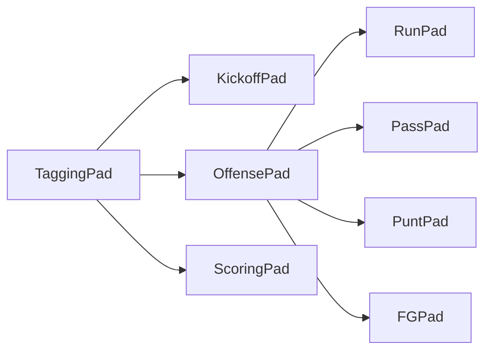

# iPad Tagging Spec (living document)

> **Status:** Package I — §2.4 manual iPad pass 2026-05-27; full A–I manual + UX backlog open ([package-i-qa-report.md](./package-i-qa-report.md)). Package D2 complete — usage-weighted jersey grid + passer auto-default. Prior: Package H — live ball. Prior: Package G.
>
> **Related:** [field-position-model.md](./field-position-model.md) · [adr/0001-spot-encoding-field-name.md](./adr/0001-spot-encoding-field-name.md) · [dev-quickstart.md](./dev-quickstart.md) · [next-session-tagging-ux.md](./next-session-tagging-ux.md)
>
> **Do not rebuild** sync API, platform Postgres, or `PlaylistData` schema unless broken — those layers work.

---

## 1. Locked layout & shell

| Rule | Detail |
|------|--------|
| Device | Landscape iPad Pro (~12.9") |
| Split | **72/28** — tagging pad left, sidebar right |
| Save | **Bottom-right of sidebar only** — never on the pad |
| Sidebar | Last **2** plays (tappable edit), catch-up, resume live |
| Primary path | Large tap targets; **no keyboard** for jersey selection during live tagging |
| Data | All saves through `saveLocalPlay` / `updateLocalPlay` + `PlaylistData` |
| One screen | No vertical ScrollView as primary tagging surface; conditional sections only |

### Sidebar controls

| # | Element | When visible |
|---|---------|--------------|
| 1 | Catch-up missed play | Always |
| 2 | Resume live · play #N | Editing OR catch-up mode |
| 3–4 | Last 2 saved plays | ≥1 play exists |
| 5 | SAVE PLAY | Always (bottom-right) |

---

## 2. Foundations

### 2.1 Ball spot chain

Taggers record **where the ball ended**, not “+50 yards.” Every next snap inherits the previous play’s end spot.

| Concept | Definition |
|---------|------------|
| **Ball spot at snap** | `draft.yardLine` (Hudl export) — from previous play or kickoff chain |
| **Play end spot** | Tackle spot, return end, downed spot, touchback, etc. |
| **Next snap spot** | Play end spot — header shows it; tagger does not re-enter LOS manually |
| **Gain/loss** | `yardsAdvanced(ballSpot, endSpot)` on 0–100 axis → stored in `gainLoss`, shown **read-only** |

See [field-position-model.md](./field-position-model.md). Code: `apps/mobile/lib/tagging/fieldPosition100.ts`.

Spot strings live in **`spotEncoding`** ([ADR-0001](./adr/0001-spot-encoding-field-name.md)). Patterns differ by play family — **catch/receive + end is not pass logic**:

| Play family | `spotEncoding` | Tagger marks |
|-------------|----------------|--------------|
| **Kickoff / punt return** | `catch:X\|end:Y` or `recv:X\|end:Y` | Catch or receive spot **and** return end (return yards need both) |
| **Run / pass (complete, sack, rush TD)** | `tackle:LOS\|end:Y` (or `end:TD` / `end:SA`) | Snap spot + **where the play ended** only |
| **Pass incomplete / tipped** | *(empty)* | LOS unchanged; `gainLoss = 0` |
| **Interception return** | `catch:X\|end:Y` | Live-ball return after INT — same return pattern as kickoff, **not** pass-completion geometry |

We do **not** tag “caught at X, carried to Y” on complete passes today. Total pass/run gain is snap → end via `gainLoss`. **Future:** yards-after-catch (e.g. catch at Opp 15, tackled at Opp 17) may add a second spot later — not in current iPad UI.

### 2.2 Down chain

| Outcome | Next down/distance | Ball spot | gainLoss |
|---------|-------------------|-----------|----------|
| Gain ≥ distance | **1st & 10** | End spot | computed |
| Gain < distance, down 1–3 | Down+1, distance − gain | End spot | computed |
| **Incomplete** / **Tipped pass** | Down+1, distance **unchanged** | **Unchanged** | **0 always** |
| **Failed 4th** (go for it, short) | Turnover — see §2.3 | End spot | auto **`result: COP`** on save |

**Penalties (most flags):** replay **same down**; yardage from **spot of foul** (Package H). Example: 2nd & 10 @ Own 40, holding at Own 42 → **2nd & 18 @ Own 32**.

### 2.3 Touchback vs turnover

**Touchbacks** reset the ball to **Own 20** (HS). They are **not** COP results.

| Touchback type | Tagged as | Next |
|----------------|-----------|------|
| Kickoff touchback | KO + Touchback | Offense **@ Own 20** |
| Punt touchback | Punt + Touchback | Receiving offense **@ Own 20** |
| Missed FG **into end zone** | FG + No Good (into EZ) | Receiving offense **@ Own 20** |

**Turnovers (COP / live ball)** — spot varies:

| Type | Next spot |
|------|-----------|
| Failed 4th (auto COP) | @ spot of play |
| Interception | @ return end |
| Fumble lost | @ recovery / return end |
| FG No Good **in field of play** | Opponent @ line of scrimmage |
| Blocked punt/FG returned | @ return end |

### 2.4 Canonical drive (acceptance test)

| Play | Situation | Tag | End spot | Internal | gainLoss | Next |
|------|-----------|-----|----------|----------|----------|------|
| 1 KO | Kickoff @ Own 40 | Return to Own 25 | −25 | 25 | +20 | 1st & 10 @ Own 25 |
| 2 Run | 1st & 10 @ Own 25 | Tackled Opp 25 | +25 | 75 | **+50** | 1st & 10 @ Opp 25 |
| N Sack | 3rd & 8 @ Opp 23 | Pass+Sack, QB **rusher** @ Opp 28 | +28 | 72 | **−5** | 4th & 13 @ Opp 28 |
| N+1 FG | 4th & 13 @ Opp 28 | Good, 38-yd attempt | — | — | — | **Kickoff** |

### 2.5 Sack semantics

| Field | Value |
|-------|-------|
| `playType` | `Pass` |
| `result` | `Sack` |
| Slots | **Rusher** (QB), Tackler — **no** Passer, Receiver |
| Yards | Tackle spot → negative `gainLoss` on rusher |

### 2.6 Field goal attempt distance

```
attemptYards = yardsToOpponentGoal(ballSpot) + 10
MAX_FG_RANGE = 62   // HS — show FG tap small when out of range, not hidden
```

Populate `kickYards` on save. Good FG → **Kickoff pad**.

---

## 3. Pad routing



After **Save**, rule-based routing picks the next pad (not a blank generic grid). User overrides only when multiple choices are valid (Run vs Pass on 1st down; XP vs 2pt after TD).

| Saved result | Next pad |
|--------------|----------|
| KO return / touchback | Offense @ end spot or Own 20 |
| Run / Pass (normal) | Offense @ tackle spot |
| Rush TD / Complete TD | Scoring (XP / 2pt or block) |
| FG / XP / 2pt Good | Kickoff |
| Punt downed / return / touchback | Receiving offense @ spot |
| Turnover (COP) | Defense or opponent offense @ spot |

---

## 4. Per-pad UX

Each pad: **type badge or PlayTypeRow → result row → spot UI → player slots → jersey grid**. Match [`KickoffTaggingPad`](../apps/mobile/components/tagging/KickoffTaggingPad.tsx) density.

### 4.1 KickoffPad *(implemented)*

- Results: Return · Touchback · Penalty (penalty deferred)
- Return: **Caught at** + **Returned to** sliders; computed return yards
- Touchback: no spots → receiving team **@ Own 20** (HS — update from current Own 25 default)
- Players: Kicker, Returner, Tackler(s) per result
- **We kick / we receive** toggle on pad top row; persisted per game (`kickoffRole` in SQLite `meta`)
- Tap budget: **≤4**

### 4.2 OffensePad shell

**PlayTypeRow** — Run · Pass · Punt · FG — **always visible** (compact strip when Run/Pass active).

- **Separate `RunPad` and `PassPad` bodies** — not one generic form
- **Mid-play switch:** one tap Run ↔ Pass (`applyPlayTypeChange`; keeps situation)
- Tap Punt / FG → full swap to PuntPad / FGPad
- **Default after new series:** RunPad, Rush selected

#### Situational tap sizes

| Scenario | Run | Pass | Punt | FG |
|----------|-----|------|------|-----|
| 1st–3rd, own side (pos < 50) | **Large** | **Large** | Small | **Tiny** |
| 1st–3rd, opp side | **Large** | **Large** | **Tiny** | Small (medium if ≤62 yd) |
| 4th, before Opp 40 | Medium | Medium | **Large** | Small/medium by range |
| 4th, inside Opp 40 | Medium | Medium | **Tiny** | By range |
| 4th, distance ≤ 2 | **Medium** | **Medium** | **Medium** | **Medium** if in range |

Implement: `getPlayTypeTapSizes(down, yardLine, distance)` in `playConfig.ts`.

### 4.3 RunPad

```
[RUN●] [pass] [punt] [fg]
Result: [ Rush ] [ Rush TD ] [ Fumble ] [ Penalty ]
Tackled at [────●────]  →  Gain/loss: +N (computed)
[ Rusher ] [ Tackler ]
[ jersey grid ]
```

| Result | Spots | Slots |
|--------|-------|-------|
| Rush | Tackle spot | Rusher, Tackler |
| Rush TD | Opp EZ / TD button | Rusher |
| Fumble | Fumble + recovery spots | Rusher; recoveredBy optional |
| Penalty | Foul spot (pkg H) | Rusher |

Tap budget: **≤4–5**

### 4.4 PassPad

```
[run] [PASS●] [punt] [fg]
[ Complete ] [ Complete TD ] [ Incomplete ] [ Sack ] [ INT ] [ Tipped Pass ] [ Penalty ]
Tackled at / INT caught-returned / (none if incomplete)
[ Passer | Rusher | Receiver | PBU | Tackler | INT by ]
[ jersey grid ]
```

| Result | Spots | Slots | gainLoss |
|--------|-------|-------|----------|
| Complete / TD | Tackle spot | Passer, Receiver, Tackler | computed |
| Incomplete | none | Passer; optional **PBU** | **0** |
| Tipped Pass | none | Passer; optional **PBU** | **0** |
| Sack | Tackle spot | **Rusher**, Tackler | computed loss |
| INT | Caught-at + returned-to | Passer, interceptedBy, tackler | per return |

**PBU** = pass broken up **by** — separate optional slot, not tackler.

Tap budget: incomplete **≤3**; complete **≤6**

### 4.5 PuntPad

```
[ PUNT ]  [ Downed | Return | Touchback | Blocked | Penalty ]
Kicker
IF Return:  Received at + Returned to  (KO pattern)
IF Downed:   Downed at only
IF Touchback: (auto @ Own 20)
IF Blocked:  Recovered at + Returned to (pkg H)
[ jersey grid ]
```

| Result | Next |
|--------|------|
| Downed | Receiving offense @ downed spot, 1st & 10 |
| Return | @ return end |
| Touchback | @ **Own 20** |
| Blocked | Live ball — pkg H |

`spotEncoding`: `recv:+15|end:-32`

### 4.6 FGPad

```
[ FG ]  [ Good | No Good | Blocked | Penalty ]
Attempt: 38 yd (computed)
Kicker
IF No Good: [ In field | Into end zone ]
IF Blocked: recovery spots (pkg H)
[ jersey grid ]
```

| Result | Next |
|--------|------|
| Good | Kickoff |
| No Good (field) | Opponent @ LOS |
| No Good (into EZ) | Touchback **@ Own 20** |
| Blocked | Live ball — pkg H |

### 4.7 ScoringPad *(implemented — Package G)*

After TD: pre-load **Extra Pt.** (O) or **Extra Pt. Block** (D); hide generic play-type grid. XP ↔ 2pt toggle.

| Type | Results | Next after save |
|------|---------|-----------------|
| Extra Pt. / 2 Pt. | Good · No Good | Kickoff (We kick) |
| Extra Pt. Block / 2 Pt. Block | Good · No Good · Blocked | Kickoff (We receive) |

Opponent made PAT = **Good** on Extra Pt. Block (score +1 them). Miss = **No Good** (no points, still kickoff).

### 4.8 Defense tagging

When `odk: D`:

- **Priority:** our **tacklers** (tackler1/2)
- Opponent passer/rusher/receiver: show if time allows; **do not block save**
- Unofficial live stats — completeness over perfection

---

## 5. Usage-weighted jersey grid (Package D2)

Aggregate jersey counts from **saved plays in this game** (local SQLite).

| Slot | Behavior |
|------|----------|
| **Passer** | Auto-default game leader; one QB → pre-fill every PassPad snap |
| **Rusher** | Larger cells for high carry counts (25/10/5/1 pattern) |
| **Receiver** | Larger for frequent targets |
| **Tackler** | Boost repeat tacklers; **cap one Hero** — expect 10–12 different tacklers |
| **PBU** | Light weighting when tracked |

**Tiers:** Hero (~2× tap) · Frequent · Standard · Small (never used, still tappable)

Early game: sort by **two-deep** via `POSITION_GROUPS` until counts accumulate.

API: `buildJerseyGridRankings()` in `lib/tagging/jerseyGridRank.ts`.

---

## 6. Full transition matrix (planned)

| Type | Result | This pad | Next after save |
|------|--------|----------|-----------------|
| KO | Return | Kickoff | Offense @ return end |
| KO | Touchback | Kickoff | Offense @ **Own 20** |
| KO | Penalty | Kickoff | Defer |
| Run | Rush | RunPad | Offense @ tackle spot |
| Run | Rush, TD | RunPad | Scoring |
| Run | Fumble | RunPad | Recovery / COP — pkg H |
| Run | Penalty | RunPad | Replay down — pkg H |
| Pass | Complete | PassPad | Offense @ tackle spot |
| Pass | Complete, TD | PassPad | Scoring |
| Pass | Incomplete | PassPad | Offense @ same spot, gain=0 |
| Pass | Sack | PassPad | Offense; rusher=QB |
| Pass | INT | PassPad | COP @ return end — pkg H |
| Pass | Tipped Pass | PassPad | Incomplete + optional PBU |
| Pass | Penalty | PassPad | pkg H |
| Punt | Downed | PuntPad | Receive @ downed spot |
| Punt | Return | PuntPad | Receive @ return end |
| Punt | Touchback | PuntPad | Receive @ Own 20 |
| Punt | Blocked | PuntPad | pkg H |
| FG | Good | FGPad | Kickoff |
| FG | No Good (field) | FGPad | Opponent @ LOS |
| FG | No Good (into EZ) | FGPad | Touchback @ Own 20 |
| FG | Blocked | FGPad | pkg H |
| Extra Pt. | Good | Scoring | Kickoff |
| Extra Pt. | No Good | Scoring | Kickoff (missed try) |
| Extra Pt. Block | Blocked | Scoring | Kickoff |
| 2 Pt. | Good | Scoring | Kickoff |
| 2 Pt. | No Good | Scoring | Kickoff (missed try) |
| 2 Pt. Block | Blocked | Scoring | Kickoff |
| Run / Pass / Return | Safety / `end:SA` | any | Free kick — scored-upon @ Own 20 (`KO` if we were O; `KO Rec` if we were D) |

**Remaining code gaps:** post-block kickoff edge cases (§10).

---

## 7. Scrimmage kick vs free kick

| | Free kick (KO) | Scrimmage kick (Punt, FG) |
|---|----------------|---------------------------|
| Snap live? | No | **Yes** |
| Turnovers | After kick | Bad snap, blocked return, fakes (Phase 2) |

---

## 8. Tap budgets

| Flow | Max taps |
|------|----------|
| KO return | 4 |
| Run normal | 4–5 |
| Run TD | 4 |
| Pass complete | 6 |
| Pass incomplete | 3 |
| Pass sack | 5 |
| FG good | 4 |
| Post-TD XP | 3 |

---

## 9. Decision log

| Date | Decision |
|------|----------|
| 2026-05-25 | 72/28 sidebar; KickoffTaggingPad; caught/returned sliders |
| 2026-05-27 | Tackle spot → gainLoss (not gain slider) |
| 2026-05-27 | Ball spot chain; sack = Pass+Sack, rusher only |
| 2026-05-27 | Auto COP failed 4th; MAX_FG_RANGE 62 |
| 2026-05-27 | HS touchback @ Own 20 (KO, punt, missed FG into EZ) |
| 2026-05-27 | COP ≠ touchback |
| 2026-05-27 | Incomplete/tipped gainLoss = 0; optional PBU |
| 2026-05-28 | OffensePad: RunPad + PassPad; PlayTypeRow always visible; mid-play switch |
| 2026-05-28 | Usage-weighted jersey grid; passer auto-default |
| 2026-05-28 | **Package A spec written** |
| 2026-05-27 | **Package G:** ScoringPad; TD→XP/2pt or block chain; we kick/we receive on KickoffPad |

---

## 10. Open questions

- **Game state on accidental quit (potential concern, not prioritized):** Saved plays and game metadata (score, phase, status, opening kickoff role) persist in local SQLite (`huddlestat.db`) and survive app restart — home screen resumes the game. **In-progress draft** (pad taps before SAVE) and transient UI (catch-up mode, edit-in-progress, spot sliders) live only in React state on `app/game/[id].tsx`; force-quit or OS kill mid-play loses that unsaved work. No draft checkpoint today. Revisit only if taggers report real data loss in the field.
- XP attempt yard line: Hudl −3 vs +3 at opponent goal
- After opponent TD + our XP block: who kicks off? (toggle defaults to last choice)
- 2pt player slot matrix
- Auto COP saved row: `result: COP` only (planned yes)

---

## 11. Implementation packages

| Pkg | Scope |
|-----|--------|
| **A** | **This spec** ✓ |
| **B** | `nextDraftAfterPlay`, fix `advanceSituation`, touchback @ Own 20, unit tests |
| **C** | `TackleSpotPanel`; remove gain slider |
| **D** | OffensePad + RunPad + PassPad + PlayTypeRow + situational taps |
| **D2** | Usage-weighted `JerseyQuickGrid` ✓ |
| **E** | PuntPad |
| **F** | FGPad |
| **G** | **ScoringPad + kickoff team declaration** ✓ |
| **H** | **Live ball: fumble, INT, blocked kicks, penalties** ✓ |
| **I** | **iPad QA** — automated ✓; manual **§2.4 ✓** 2026-05-27; A–I manual + UX items open ([report](./package-i-qa-report.md)) |

**Deferred:** stats revisit UX (quarter/halftime), fake punt/FG, full penalty library, KO penalty edge cases.

---

## 12. Next session prompts

### Package B — chain logic

```
Execute Package B: play chain logic for HuddleStat iPad tagging.

Read: docs/ipad-tagging-spec.md, docs/field-position-model.md
Implement: nextDraftAfterPlay in packages/shared, fix advanceSituation,
HS touchback @ Own 20, auto COP on failed 4th, incomplete gainLoss=0.
Unit tests for canonical drive in spec §2.4.
Do NOT rebuild sync API / PlaylistData.
```

### Stats revisit (future)

```
HuddleStat: design stats revisit UX at quarter/halftime/TD breaks.
Read: docs/ipad-tagging-spec.md §4.8, §5.
Surface missing tacklers, recoveredBy, PBU; backfill without leaving live tag.
```
