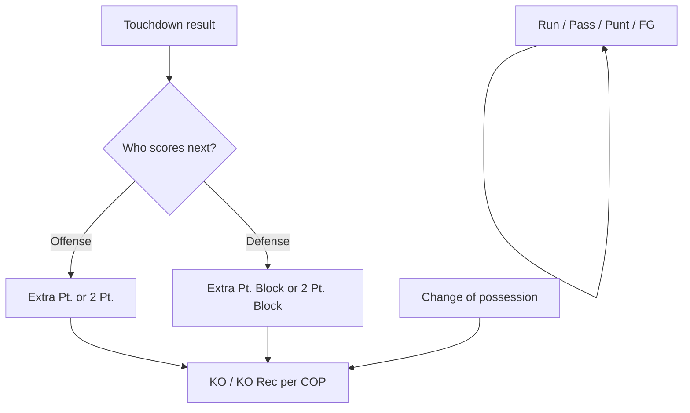

# Next session: tagging UI/UX (plan + budget)

> **Package A complete:** Full UX spec is now in **[ipad-tagging-spec.md](./ipad-tagging-spec.md)** (2026-05-28). Start **Package B** (chain logic) for code.

**Prerequisite:** [dev-quickstart.md](./dev-quickstart.md) — sync and live web are working; do not rebuild sync API unless broken.

**Also read:** [field-position-model.md](./field-position-model.md), [handoff-ipad-tagging-ui.md](./handoff-ipad-tagging-ui.md), `apps/mobile/lib/tagging/kickoffReturn.ts` (spot-based yards pattern).

---

## Goals

1. **Per play-type screens** — each major type (run, pass, KO, punt, FG, scoring) gets a layout tuned for tap budget, not one generic pad.
2. **Scoring transitions** — after a TD, next snap is XP or 2pt (offense) or XP block / 2pt block (defense); COP and kickoff chains stay explicit.
3. **Tackle spot → gain/loss** — replace gain/loss slider with “where were they tackled?” (and compute `gainLoss` from ball spot + end spot on 0–100 axis).

---

## Play transition map (product rules)



| Previous result | Team perspective | Next play types to surface |
|-----------------|------------------|----------------------------|
| Rush/Pass TD (`Rush, TD` / `Complete, TD`) | Scoring team offense | `Extra Pt.`, `2 Pt.` |
| Same TD | Opponent defense | `Extra Pt. Block`, `2 Pt. Block` |
| Good FG / XP / 2pt Good | — | Kickoff or receive per game state |
| Punt / COP / turnover | — | Field position + new ODK |
| Kickoff return end | — | Already handled → offensive `1st & 10` |

Implementation hook: extend `nextDraftAfterSave()` / `advanceSituation()` in `apps/mobile/app/game/[id].tsx` and shared `advanceSituation` in `packages/shared` if needed.

---

## Work packages (budget)

Rough sizing for **one focused agent session** each; can parallelize after spec is signed off.

| # | Package | Scope | Size | Notes |
|---|---------|--------|------|-------|
| A | **UX spec** | Screen-by-screen wire tap counts per play type; TD → XP/2pt flows | **M** | Deliver/update `docs/ipad-tagging-spec.md` before heavy code |
| B | **Scoring transition logic** | After TD, auto-suggest XP/2pt or block; correct `odk`, `playType`, down/distance | **M** | Shared rules + unit tests on `advanceSituation` |
| C | **Run / pass tackle spot** | End spot slider or grid; `gainLoss = endPos - startPos` via `fieldPosition100` | **L** | Reuse kickoff “return end” pattern from `KickoffReturnSpots` |
| D | **Play-type screen shells** | Route or mode switch: RunPad, PassPad, KOPad, PuntPad, FGPad, ScoringPad | **L** | Extract from `TaggingPad.tsx` |
| E | **Defense scoring pads** | `Extra Pt. Block`, `2 Pt. Block` player + result UI | **S** | Depends on B |
| F | **Remove / hide gain slider** | Delete `gainLoss` stepper where tackle spot exists | **S** | After C |
| G | **QA pass** | iPad device, sync one full drive, verify Hudl-shaped row on platform live page | **S** | Use [dev-quickstart.md](./dev-quickstart.md) URLs |

**Suggested order:** A → B → C → D → E → F → G

**Total:** ~2–3 deep sessions (or one long push if spec is tight).

---

## Tackle spot design (direction)

- **Inputs:** ball spot at snap (already on draft `yardLine`) + **tackle spot** (Hudl yard line or field slider).
- **Output:** `gainLoss = yardsAdvanced(start, tackleSpot)` from `fieldPosition100.ts` (same as kickoff return math).
- **UI:** mirror `FieldPositionSlider` + end-zone actions (Safety / TD) where relevant; no free-form +/- for live tagging.
- **Edge cases:** loss of yardage, midfield crossing, own/opp numbering — all via internal 0–100 (see field-position doc).

---

## Copy-paste prompt for next Cursor session

```
Continue HuddleStat tagging UX. Read first:
1. docs/dev-quickstart.md
2. docs/next-session-tagging-ux.md
3. docs/field-position-model.md
4. apps/mobile/app/game/[id].tsx, components/tagging/*, packages/shared advanceSituation

Do NOT rebuild sync API unless broken.

This session: [pick package A/B/C from plan — user will say which to start]

Priority: play-type screens + TD → XP/2pt (or block) transitions + tackle spot computes gainLoss (remove gain slider).
```

---

## Out of scope (later)

- Roster grid from platform Postgres `players` table (future)
- Undo last play + outbox reconcile
- Session B: Huddle screenshot comparison
- Web dashboard polish beyond live play log
